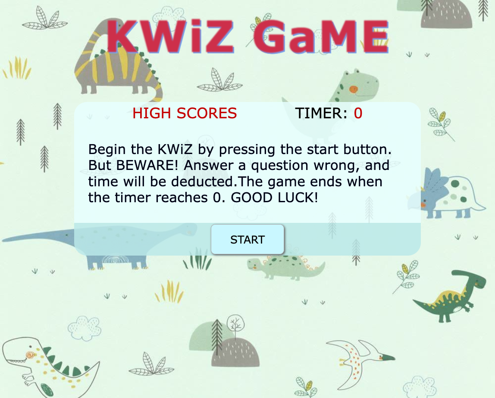
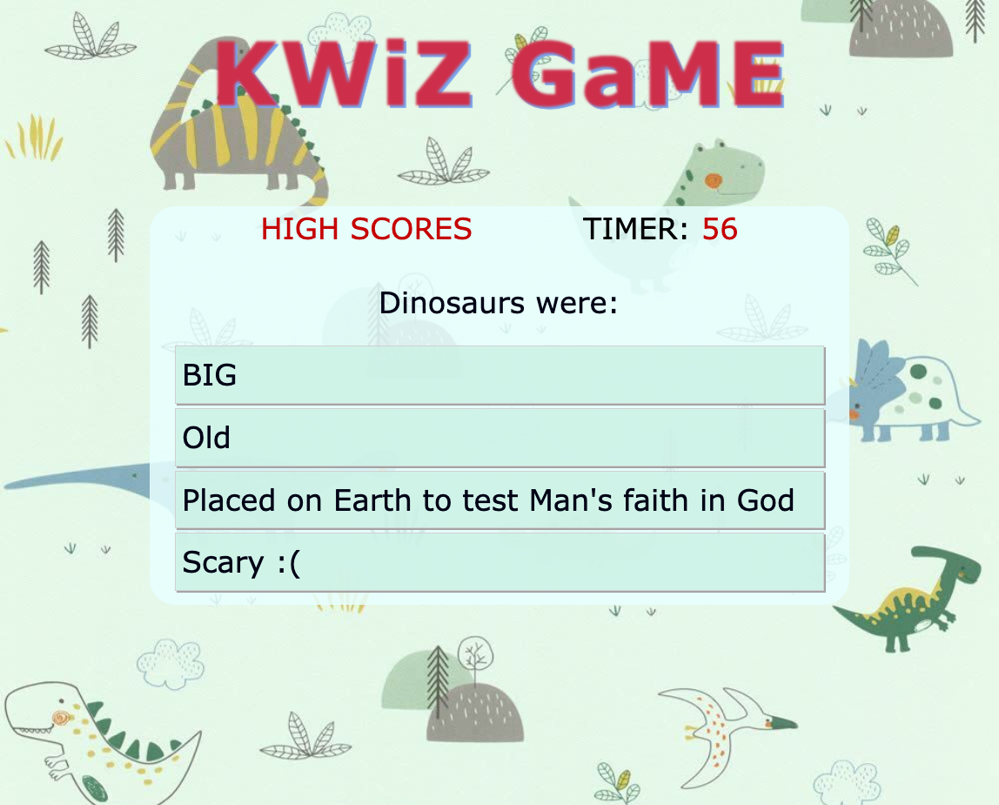
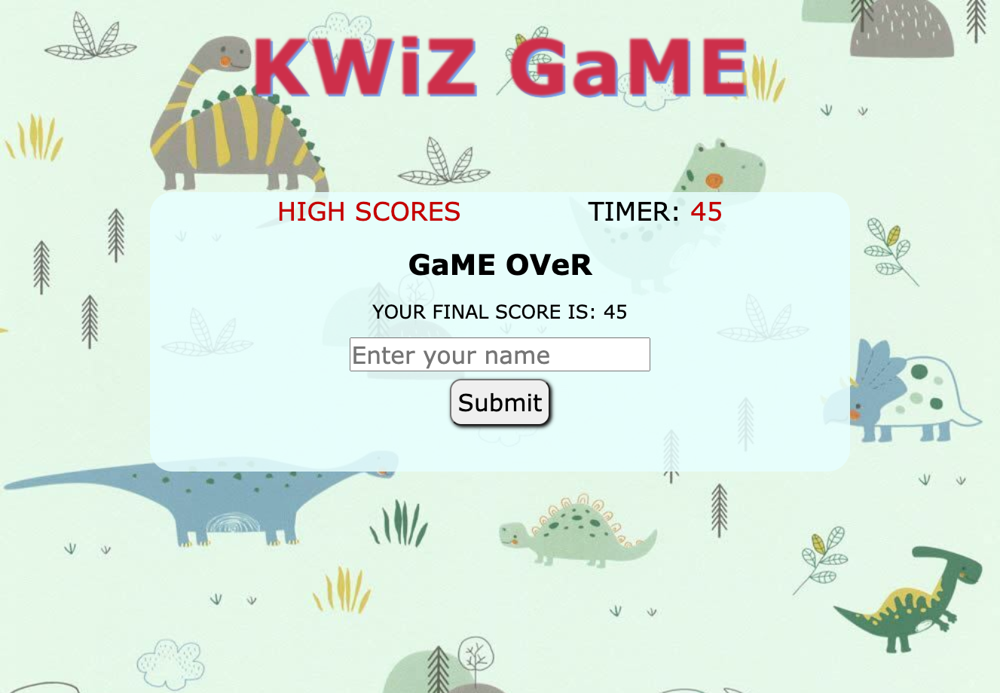
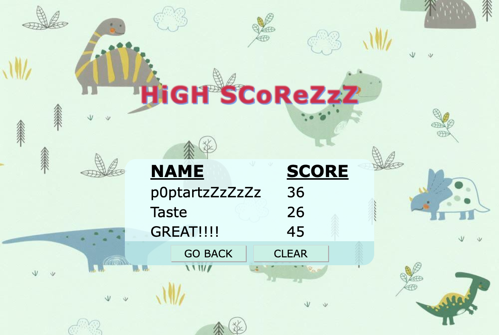

# HW04-QUIZ-GAME

## Descrition:
A responsive quiz game built with HTML, CSS and Vanilla JavaScript.  Users names and scores will be stored locally and displayed on a secondary HTML page.  

SiLLy quEStionS with siLLieR answerZzZz.  g00d lucK!
#
## Screenshots:

Starting Page

Question Example

Game Over

High Score Page

#

## Live Link: 